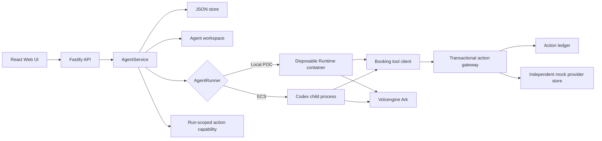

# Architecture

Volc Agent Launchpad is a single-node control plane for hackathon use.



## Components

### Web UI

Lists Agents, manages lifecycle actions, submits prompts, and polls asynchronous
Runs. It never receives the Ark API key.

### Fastify API

Validates requests, protects remote demos with a shared bearer token, and
serves the compiled Web UI. The token is not user identity or authorization.

### AgentService

Coordinates lifecycle state, persistence, workspaces, and Runs. One Agent can
have only one active Run.

```text
ready -> busy -> ready
  |       |
  v       v
stopped  error
```

Interrupted Runs become `cancelled` after a restart.

### Agent Action Ledger

`ActionCoordinator` is the transaction boundary for `booking.create`. It
persists `prepared` and `executing` before invoking the independent mock
provider. The provider owns idempotency; the coordinator owns orchestration,
reconciliation, evidence, and input-conflict rejection.

Each active Run receives a random, time-limited capability for the booking
tool. Only its hash is retained in memory. The internal gateway derives the
Agent and Run from that capability instead of trusting request body identity.

```text
prepared -> executing -> succeeded
                 |
                 +-> worker crash -> executing -> reconcile -> succeeded
                 |
                 +-> ambiguous provider error -> outcome_unknown
```

The provider data is deliberately stored separately from `launchpad.json` so
tests can reproduce the critical window where the external effect committed
but the local success record did not.

### Storage

```text
data/launchpad.json       Agent, message, and Run metadata
data/mock-bookings.json   Independent idempotent mock provider state
workspaces/AgentID/       Agent-created files
workspaces/.deleted/      Archived deleted workspaces
codex-home/               Codex configuration and sessions
```

`JsonStore` serializes writes and atomically replaces one JSON file. It supports
one process only.

### Runtime providers

- `CodexRunner` runs Codex inside the application container for ECS.
- `ContainerCodexRunner` starts one disposable Docker, Colima, or Podman
  container for every local turn.

Both providers use argv-only process execution, bound output and time, resume
the stored Codex thread, and escalate termination after a grace period.

## Deployment profiles

| Profile | Control plane | Agent execution |
| --- | --- | --- |
| Local POC | Host Node.js | Disposable local container |
| ECS | Application container | Codex process in the same container |
| Local development | Host Node.js | Host Codex process |

## Extension seams

| Track | Primary seam | Expected change |
| --- | --- | --- |
| Glass Box | `AgentRunner`, `AgentRun` | Emit and display correlated execution events. |
| Bouncer | API routes, Agent ownership | Add identity and server-side authorization. |
| Kill Switch | `AgentRunner` | Add threat-specific policy or a stronger sandbox. |

The current container or ECS instance is the POC trust boundary. Ordinary
containers are not hardened multi-tenant isolation.
